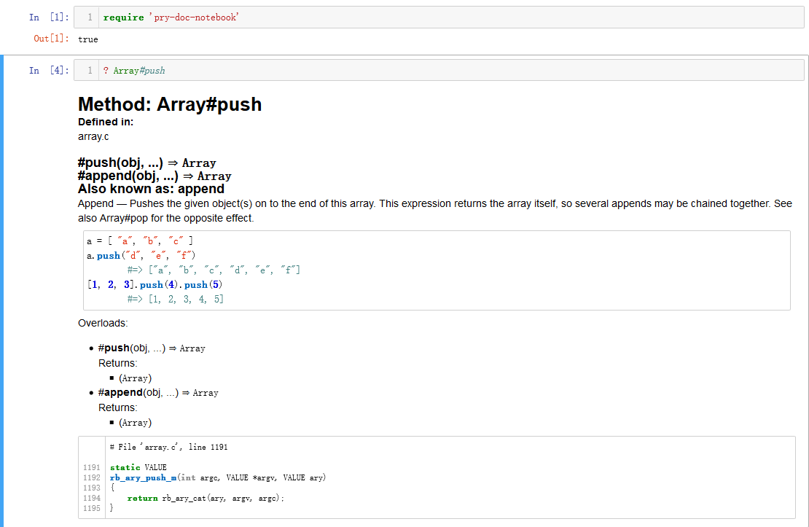

# Pry::Doc::Notebook

Pry Doc Notebook is a Pry REPL plugin for IRuby Notebook. It provides a `?` commands.
With help of the plugin the commands are be able to display documentation with html format.

## Installation

    $ gem install pry-doc-notebook

## Usage

## Contributing

Bug reports and pull requests are welcome on GitHub at https://github.com/zheng-yongping/pry-doc-notebook.
